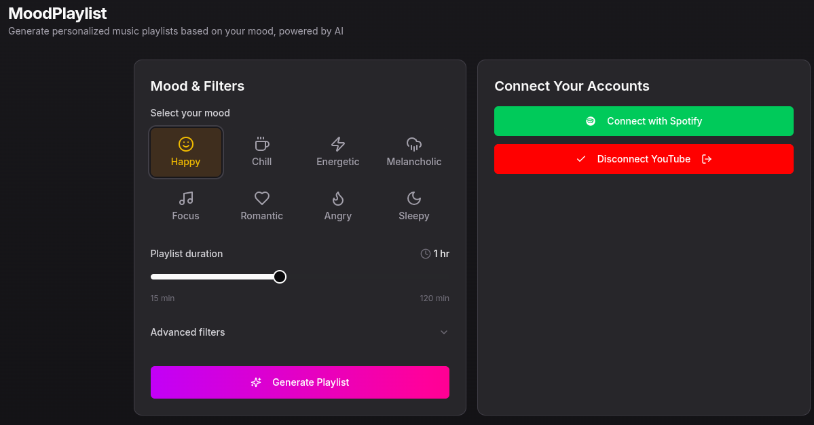
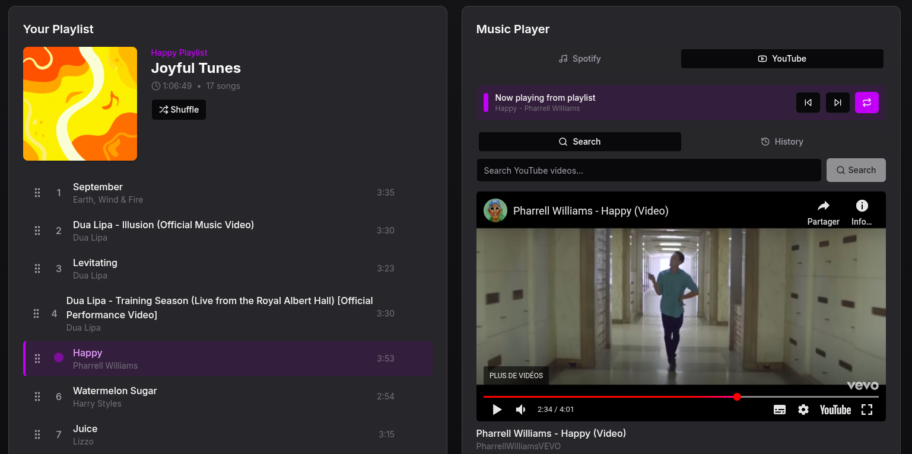

# Mood_Playlist
## [Personal PROJECT]

Playlist generator based on the mood of the sounds, duration and other parameters with youtube and spotify Oauth.

## [WIP]
- Spotify Oauth still not working.
- When not connected the playlist select from a predefined song pool.
- The Youtube Oauth work for me but will not work for other since I only put my email for the user test on google Oauth settings.

---
## 
 V Screenshot V 

## Parameters you can use for your playlist

- Duration:
    - from 15 to 120 minutes
- Mood:
    - Happy | Chill | Energetic | Melancholic | Focus | Romatinc | Angry | Sleepy
- BPM Range:
    - 60 to 200
- Energy Level:
    - 0% to 100%
- Genres:
    - Pop | Rock | Hip-Hop | R&B | Electronic | Jazz | Classical | Country | Folk | Indie
